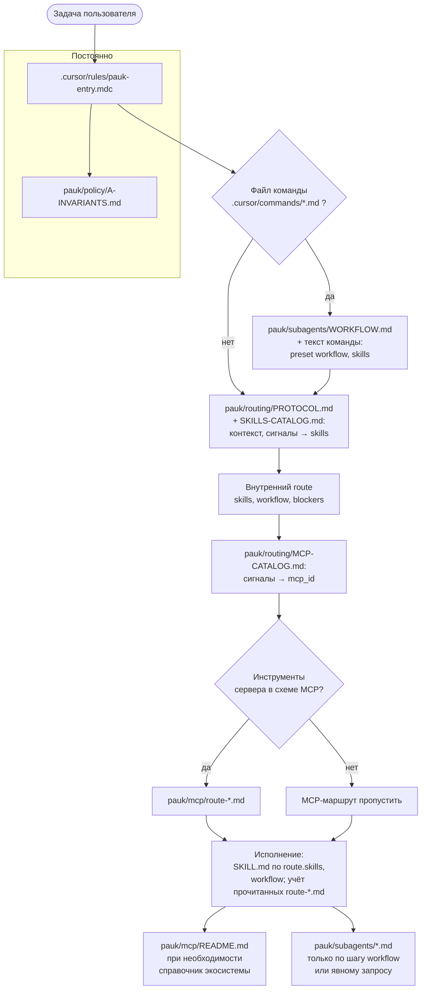

# Pauk

## 1. О проекте

**Pauk** — оснастка для ИИ-ассистента при разработке на **1С**: код, формы, запросы, метаданные, обзоры и длинные циклы «от идеи до приёмки». Пакет подключается к репозиторию с проектом и задаёт **единый стиль диалога**: что считать инвариантами, какие знания подмешивать по смыслу задачи и когда выносить работу в отдельные роли.

**Идея:** не один огромный системный промпт, а **слои** — короткие правила входа, тематические навыки по запросу, жёсткие пресеты для больших сценариев и субагенты с изолированным контекстом. Модель чаще идёт по предсказуемой траектории, а вы контролируете глубину «автопилота» vs явного сценария.

**Термины (кратко):**

| Термин | Смысл |
|--------|--------|
| **Правила (rules)** | То, что агент всегда видит в начале: вход в пакет, политика, отсылки к маршрутизации. |
| **Навыки (skills)** | Сжатые знания по темам (BSL, формы, запросы, ошибки, БСП, метаданные и т.д.); подключаются по релевантности задачи и контекста. |
| **Flow** | Заранее описанный длинный сценарий (фазы, артефакты, ссылки); запускается **командой** в IDE или по markdown-инструкции. |
| **Субагент** | Отдельный «специалист» под узкий тип работы (ревью, метаданные, дизайн и т.п.); можно вызывать вручную и строить из них свой порядок. |
| **Маршрутизация** | Логика «когда что читать»: классификация задачи и связка навыков, flow и субагентов (см. материалы пакета `pauk/routing/`). |

---

## 2. Как устроено

Снаружи это **точка входа в правилах** и **дерево материалов** под каталогом поставки: политика и инварианты, справочники, каталог навыков по областям платформы, описания субагентов и пресетов рабочих процессов. Внутри — **протокол маршрутизации**: от типа задачи к нужным фрагментам знаний и к решению, выносить ли шаг в flow или в субагента.

Так устроено намеренно: **короткий общий слой** держит поведение в рамках, **толстый слой** с документами не засоряет каждый запрос — он подтягивается, когда в этом есть смысл. Репозиторий, в котором вы это читаете, совмещает **роль «фабрики»** (развитие оснастки, `docs/`) и **роль поставки**; в прикладной проект копируется только готовый фрагмент поставки (см. раздел про репозиторий и фабрику ниже).

### Схема маршрутизации (поставка `pauk-product/`)

Пути — от корня прикладного репозитория после копирования пакета.

---

## 3. Как пользоваться

Три взаимоисключающих по смыслу режима — от «ничего не настраиваю» до «я сам режиссёр». Обычно хватает первого.

**1) Обычный режим**  
Открываете проект с подключённым Pauk, пишете задачу как привыкли: цель, границы, ссылки на файлы. Агент опирается на **rules** и по ходу подмешивает **skills**; отдельные flow и субагенты не обязательны.

**2) Готовый flow**  
Нужен **фиксированный длинный контур** (одни и те же фазы и артефакты независимо от формулировки). Тогда запускаете **команду** из оснастки (например, полный цикл реализации или только техдизайн с нарезкой задач) и следуете шагам из пресета — порядок задан сценарием, а не свободным чатом.

**3) Свой flow**  
Не хотите ни «всё автоматом», ни чужой пресет целиком: **сами вызываете нужных субагентов** в удобном порядке под вашу цепочку (сначала обзор, потом рефакторинг и т.д.). Это ваш кастомный маршрут с полным контролем шагов.

**Установка** — в разделе ниже; **MCP** — опционально, отдельный раздел после установки; **фабрика** — в конце README.

---

## 4. Установка

- Нужен **агент с поддержкой rules** (например, **Cursor** с чтением каталога **`.cursor/rules`**, либо другая среда, где к проекту применяются аналогичные правила из репозитория).

1. Скопировать в **корень** целевого репозитория с **1С-проектом** два каталога из поставки: **`pauk`** и **`.cursor`**.  
   В исходниках этого репозитория они лежат в каталоге **`pauk-product/`** (содержимое: `pauk/`, `.cursor/`).
2. Проверить наличие файлов вроде `.cursor/rules/pauk-entry.mdc` и `pauk/routing/PROTOCOL.md`.
3. Если папка `pauk` переименована, обновить пути в `pauk-entry.mdc` и в явных ссылках внутри `pauk/`.

Пути к платформе 1С, строки подключения к ИБ и сценарии выгрузки/загрузки в пакет **не** вшиваются: регламент — в `pauk/reference/infobase-sync.md` и в настройках **вашего** репозитория.

---

## 5. MCP (Рекомендуется)

### 1. [mcp-bsl-platform-context](https://github.com/alkoleft/mcp-bsl-platform-context)

Справка по **встроенному языку и объектной модели** установленной платформы 1С.

Требования:
1. Java **17+**.
2. JAR **`mcp-bsl-context-*.jar`** с [Releases](https://github.com/alkoleft/mcp-bsl-platform-context/releases).
3. В конфигурации MCP: `java` … `-jar` **абсолютный путь к jar** `--platform-path` **каталог установки платформы 1С**.

---

## 6. Репозиторий и «фабрика»

Этот Git-репозиторий — **и поставка оснастки, и среда развития**: в **корне** лежат материалы **фабрики** (`docs/` — концепции, бэклог, соглашения для **разработчиков** оснастки). В **прикладной** репозиторий копируется **только** подкаталог **`pauk-product/`** (каталоги `pauk` и `.cursor`). Редакционные правила пакета для копирования — в `docs/PRODUCTION-BUNDLE.md`.

Для разработчиков фабрики: краткая концепция слоёв и ссылок на канонические файлы — [`docs/CONCEPT.md`](docs/CONCEPT.md) (её нужно **синхронизировать** с поставкой при изменении маршрутизации; чеклист в `.cursor/rules/pauk-factory.mdc`).
