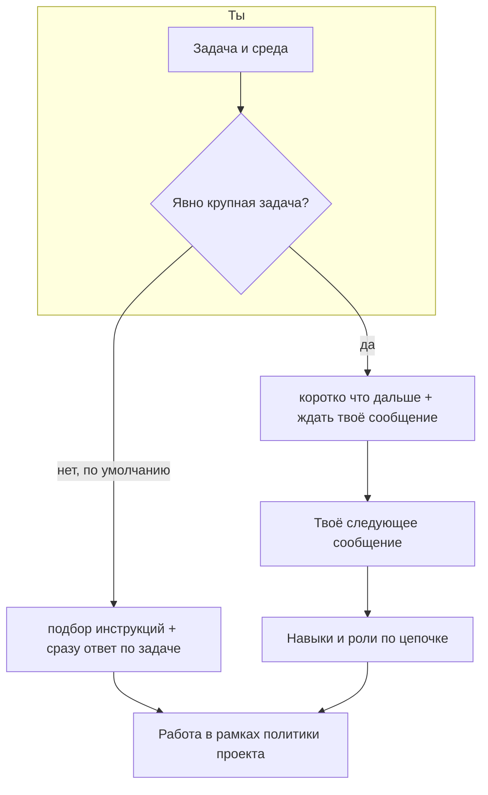

# Pauk

Оснастка для **сред разработки с использованием ИИ**, ориентированная на работу с кодом 1С.   

Даёт ассистенту общие правила, политику «что нельзя», набор **навыков** по узким темам (запросы, формы, транзакции и ошибки, БСП, стиль кода) и понятный **порядок шагов** в диалоге — чтобы не заливать в контекст всё сразу и не путать планирование с работой по коду.

В обычном случае ассистент **сразу** отвечает по задаче и подбирает к ней нужные узкие инструкции из оснастки, без отдельного опроса «насколько это большая правка». Если ты **сам** опишешь работу как крупную (полный цикл, много затронутых мест, нужен отдельный аналитический проход), диалог на первом шаге остаётся коротким: договорённость, что сделать дальше, а развёрнутое продолжение пойдёт после твоего следующего сообщения. Спросить, какие темы подключились, или попросить что-то убрать или добавить, можно обычным языком.

### От правила до навыков

1. **Правило Cursor** (в каталоге `.cursor/rules`, в поставке — `pauk-entry`) подключается само, пока открыт проект с Pauk: в нём зафиксирован порядок диалога и откуда брать материалы оснастки. Детальный контракт для модели — в `pauk/routing/PROTOCOL.md`.
2. **Политика** `pauk/policy/A-INVARIANTS.md` действует всегда: что считать готовым решением, какие вещи недопустимы, как обходиться со спорными решениями. Это общая рамка, не отдельный навык по теме.
3. **Каталог** `pauk/routing/SKILLS-CATALOG.md` — короткий перечень тем навыков и когда каждая уместна. Ассистент выбирает темы **только** из этого списка, чтобы не «придумывать» несуществующие разделы оснастки.
4. На **типичный запрос** ассистент в том же ответе уже ведёт работу по коду или конфигурации, опираясь на выбранные навыки. На **осознанно большую** задачу (как ты её описал) первый ответ остаётся лёгким; глубокий проход с длинными инструкциями и поочерёдными ролями продолжается после твоего следующего сообщения.
5. У каждой выбранной темы точка входа — файл `SKILL.md` в своей папке под `pauk/skills/`; остальные материалы навыка читаются по ссылкам из него.

**Итого:** правило задаёт ритм диалога, политика — общие красные линии, каталог и навыки дают **глубину по теме без заливки в контекст всего набора сразу**.

Подробный порядок шагов — в `pauk/routing/PROTOCOL.md`.

## Как это выглядит в работе

## Установка

Нужен **Cursor** (или среда с поддержкой `.cursor/rules`).

1. Возьми каталоги `**pauk`** и `**.cursor**` из поставки Pauk: в дистрибутиве они лежат рядом, в исходниках этого репозитория — внутри папки `**pauk-product**`. Скопируй оба каталога в **корень** своего репозитория с конфигурацией, внешними обработками или выгрузкой кода 1С.
2. Убедись, что появились файлы вроде `.cursor/rules/pauk-entry.mdc` и `pauk/routing/PROTOCOL.md`.
3. Если переименуешь папку `pauk`, поправь ссылки на неё в `pauk-entry.mdc` и в путях внутри `pauk/`, где они заданы явно.

Дальше работаешь в чате как обычно: открой в Cursor папку того репозитория, куда положил `pauk` и `.cursor` — правила подхватятся сами.

---

**Про этот репозиторий:** здесь же живёт «фабрика» — черновики идеи, `docs/` и развитие того же пакета. Если тебе нужна только оснастка в проекте, достаточно скопировать `pauk` и `.cursor` из `pauk-product`. Разработчикам оснастки: см. `docs/PRODUCTION-BUNDLE.md`.