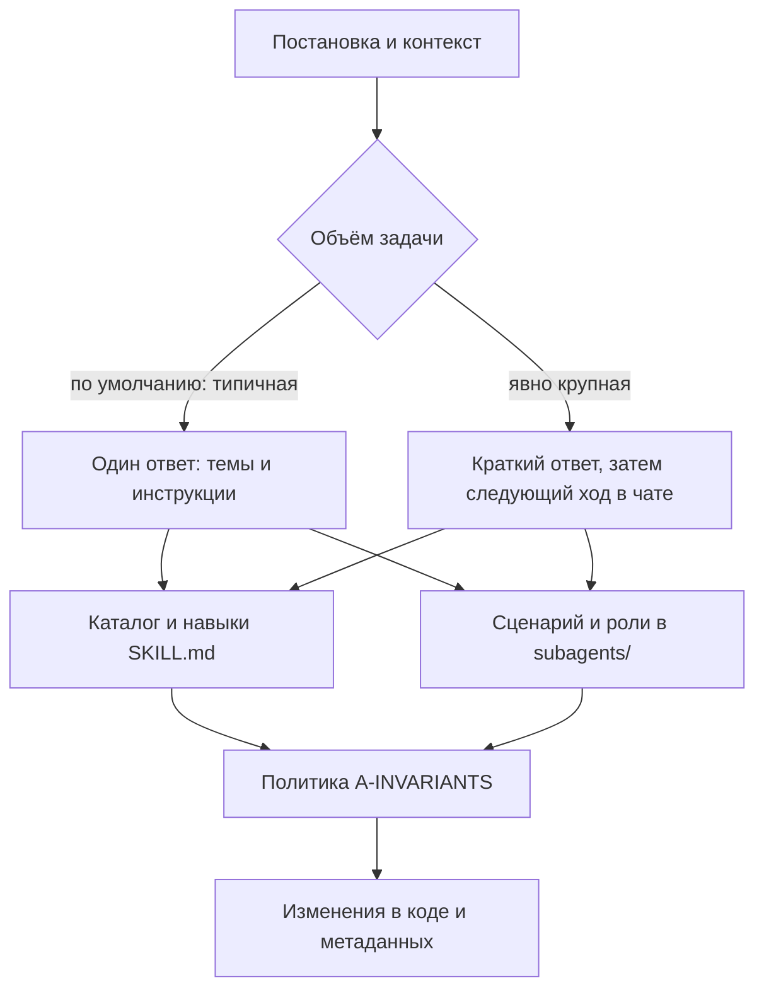

# Pauk

## 1. О проекте

**Pauk** — оснастка для **сред разработки с ИИ** при работе с **кодом и метаданными 1С** (BSL, выгрузка конфигурации, формы, запросы, интеграции). Пакет задаёт **единый ритм диалога**: что читать из репозитория, в каком порядке, и как не смешивать **короткие** и **длинные** сценарии.

**Идея:** не подмешивать в контекст весь набор инструкций сразу. Сначала определяется **подход** (типичная доработка vs крупная задача), под него выбираются **темы-навыки** и, при длинной цепочке, **шаги с ролями**; в работу идут только **нужные** файлы: **навыки** (`SKILL.md` в `pauk/skills/…`) и при необходимости **промпты ролей** (субагенты, `pauk/subagents/…`). Общие правила готовности и запреты — в **`pauk/policy/A-INVARIANTS.md`**.

**Навыки** — сжатые знания по темам (стиль BSL, формы, запросы, транзакции, БСП, метаданные и т.д.). **Роли** — шаги сценария (аналитика, разведка, проектирование, реализация, ревью, проверка); на шаге роль подключается **вместе** с релевантными навыками, а не вместо них.

---

## 2. Как устроено

### Принципы

| Идея | Как устроено |
|------|----------------|
| **Каталог тем** | Список навыков и подсказки «когда уместно» — `pauk/routing/SKILLS-CATALOG.md`. |
| **Вход в тему** | У каждой темы в каталоге есть папка `pauk/skills/…/`, начинать с `SKILL.md`, дальше — по ссылкам. |
| **Обычная задача** | Типичный путь: один заход в чате, подбор инструкций по смыслу и контексту (файлы, пути). |
| **Объёмная задача** | Если явно сказано, что работа **крупная** (полный цикл, много модулей, «с нуля» и т.п.): первый ответ **короткий**, детальное продолжение — **со следующего** сообщения в чате. |
| **Субагенты** | Роли **не** вызываются вручную по имени; сценарий и порядок — в `pauk/subagents/WORKFLOW.md`. |
| **Инструменты** | При подключённых MCP — порядок в `pauk/mcp/README.md`. |

### Схема потока

**Готовые сценарии на объёмную работу** (цепочки с планом и фазами): в поставке файлы **`.cursor/commands/flow-full-pipeline.md`** (реализация до приёмки; пресет **`full-pipeline`**) и **`.cursor/commands/flow-technical-design.md`** (ТЗ и нарезка на задачи в **`Technical-Design/`**; пресет **`technical-design`**) в **корне** проекта рядом с **`pauk/`**. В средах с **командами** по папке **`.cursor/commands`** их можно вызвать из палитры; **в других** — открыть тот же markdown и идти по шагам (пресеты и шаблоны: **`pauk/subagents/WORKFLOW.md`**, **`pauk/routing/ARTIFACT-ROUTER.md`**, **`pauk/routing/TECHNICAL-DESIGN-SCAFFOLD.md`**).

Технический контракт **маршрута** для тонкой настройки — только в `pauk/routing/PROTOCOL.md` (для тех, кто ведёт оснастку или правила вручную).

---

## 3. Использование

### Базовый сценарий

1. Открыть **корень** репозитория, куда положены `pauk/` и `.cursor/` (см. §4), в **IDE/агенте** с поддержкой **rules**.
2. Сформулировать задачу: цель, границы («не делаем»), среда без секретов; при необходимости пути к файлам или ссылки на них.
3. **Большинство** задач решается **так, без дополнительных действий:** обычный и локальный — дефолт, инструкции подбираются сами.
4. Если по смыслу работа **объёмная** — лучше **написать явно** (примеры ниже), чтобы сработал «двухшаговый» режим: сначала коротко, затем — развёрнутая работа после следующего сообщения.

### Как задать «большой» сценарий (flow)

- **По умолчанию** отдельный выбор **не** нужен: обычный чат, типичные и локальные задачи.
- Для **заранее оговорённого полного контура реализации** (анализ → архитектура/blueprint → реализация → ревью → приёмка): **`flow-full-pipeline.md`**. Для **ТЗ с нарезкой на задачи без обязательной реализации** в этом же заходе: **`flow-technical-design.md`** → каталог **`Technical-Design/`** в репозитории. Смысл: одна **та же** последовательность шагов в любом инструменте — через **команду** там, где она есть, иначе — открыть markdown и идти по ссылкам. Детали этапов и вариации — **`pauk/subagents/WORKFLOW.md`** (пресеты **`full-pipeline`**, **`technical-design`**).

### Примеры формулировок

- **Обычная доработка:** «В модуле `.../Номенклатура/.../Module.bsl` добавь проверку X перед записью, исключение по ИТС».
- **Работа с формой:** «На форме элемента справочника … скрой поле Y на клиенте, значение тянем на сервере; путь к модулю формы …».
- **Объёмная фича:** «Нужен полный цикл: аналитика, проектирование и реализация обмена с внешним API, много мест в конфигурации».

---

## 4. Установка

- Нужен **агент с поддержкой rules** (например, **Cursor** с чтением каталога **`.cursor/rules`**, либо другая среда, где к проекту применяются аналогичные правила из репозитория).

1. Скопировать в **корень** целевого репозитория с **1С-проектом** два каталога из поставки: **`pauk`** и **`.cursor`**.  
   В исходниках этого репозитория они лежат в каталоге **`pauk-product/`** (содержимое: `pauk/`, `.cursor/`).
2. Проверить наличие файлов вроде `.cursor/rules/pauk-entry.mdc` и `pauk/routing/PROTOCOL.md`.
3. Если папка `pauk` переименована, обновить пути в `pauk-entry.mdc` и в явных ссылках внутри `pauk/`.

Пути к платформе 1С, строки подключения к ИБ и сценарии выгрузки/загрузки в пакет **не** вшиваются: регламент — в `pauk/reference/infobase-sync.md` и в настройках **вашего** репозитория.

---

## 5. Репозиторий и «фабрика»

Этот Git-репозиторий — **и поставка оснастки, и среда развития**: в **корне** лежат материалы **фабрики** (`docs/` — концепции, бэклог, соглашения для **разработчиков** оснастки). В **прикладной** репозиторий копируется **только** подкаталог **`pauk-product/`** (каталоги `pauk` и `.cursor`). Редакционные правила пакета для копирования — в `docs/PRODUCTION-BUNDLE.md`.
