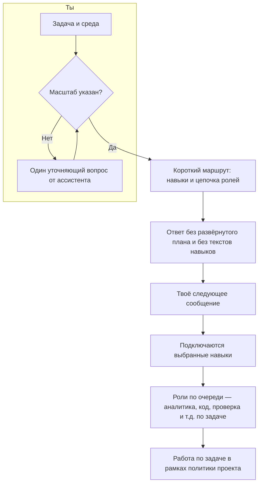

# Pauk

Оснастка для **сред разработки с использованием ИИ**, ориентированная на работу с кодом 1С.   

Даёт ассистенту общие правила, политику «что нельзя», набор **навыков** по узким темам (запросы, формы, транзакции и ошибки, БСП, стиль кода) и понятный **порядок шагов** в диалоге — чтобы не заливать в контекст всё сразу и не путать планирование с работой по коду.

Ты указываешь **масштаб** задачи (`мелкая_правка` или `нетривиально`). Сначала ассистент отвечает коротким **маршрутом** (какие навыки и какой workflow), после твоего следующего сообщения подключаются сами навыки и роли. Если маршрут неудачный, можно попросить его поправить и продолжить.

### От правила до навыков

1. **Правило Cursor** (файл вроде `.cursor/rules/pauk-entry.mdc`) подмешивается к диалогу **само**, пока открыт проект с установленным Pauk. В нём зафиксирован порядок: сначала выяснить масштаб, если его нет; затем первый содержательный ответ — **только** короткий блок `route`, без тел навыков и без длинного плана.
2. **Политика** из `pauk/policy/A-INVARIANTS.md` действует на всех шагах: что считать готовым, чего избегать, как принимать решения по спорным местам. На неё же ссылается правило — это не «навык», а рамка поверх всего диалога.
3. **Каталог маршрутизации** `pauk/routing/SKILLS-CATALOG.md` — сжатая таблица: идентификатор навыка и одна строка, когда он уместен. Именно оттуда ассистент берёт **допустимые имена** для поля `skills` в `route`; выдуманный id в маршрут класть нельзя.
4. **Первый ответ по задаче** (когда масштаб уже известен) — это YAML `route`: масштаб в терминах оснастки, цепочка ролей (`workflow`), список `skills`, при необходимости `blockers`. Тексты из `pauk/skills/.../SKILL.md` в этот же ответ **не** подмешиваются — намеренно, чтобы не смешивать «выбор дороги» и сразу десятки страниц инструкций.
5. **Следующее твоё сообщение** — сигнал перейти к работе: для каждого id из `route.skills` ассистент открывает входной файл `**pauk/skills/<id>/SKILL.md`**, остальное читает только по ссылкам из него. Параллельно по очереди подключаются **роли субагентов** из `route.workflow` (описаны под `pauk/subagents/`).

Итого: правило задаёт **ритм и границы ответов**, каталог — **меню навыков**, `route` — **что заказано на этот заход**, а `SKILL.md` — уже **полное содержание** выбранных пунктов меню.

Подробный порядок шагов и формат ответов — в `pauk/routing/PROTOCOL.md`.

## Как это выглядит в работе

## Установка

Нужен **Cursor** (или среда с поддержкой `.cursor/rules`).

1. Возьми каталоги `**pauk`** и `**.cursor**` из поставки Pauk: в дистрибутиве они лежат рядом, в исходниках этого репозитория — внутри папки `**pauk-product**`. Скопируй оба каталога в **корень** своего репозитория с конфигурацией, внешними обработками или выгрузкой кода 1С.
2. Убедись, что появились файлы вроде `.cursor/rules/pauk-entry.mdc` и `pauk/routing/PROTOCOL.md`.
3. Если переименуешь папку `pauk`, поправь ссылки на неё в `pauk-entry.mdc` и в путях внутри `pauk/`, где они заданы явно.

Дальше работаешь в чате как обычно: открой в Cursor папку того репозитория, куда положил `pauk` и `.cursor` — правила подхватятся сами.

---

**Про этот репозиторий:** здесь же живёт «фабрика» — черновики идеи, `docs/` и развитие того же пакета. Если тебе нужна только оснастка в проекте, достаточно скопировать `pauk` и `.cursor` из `pauk-product`. Разработчикам оснастки: см. `docs/PRODUCTION-BUNDLE.md`.