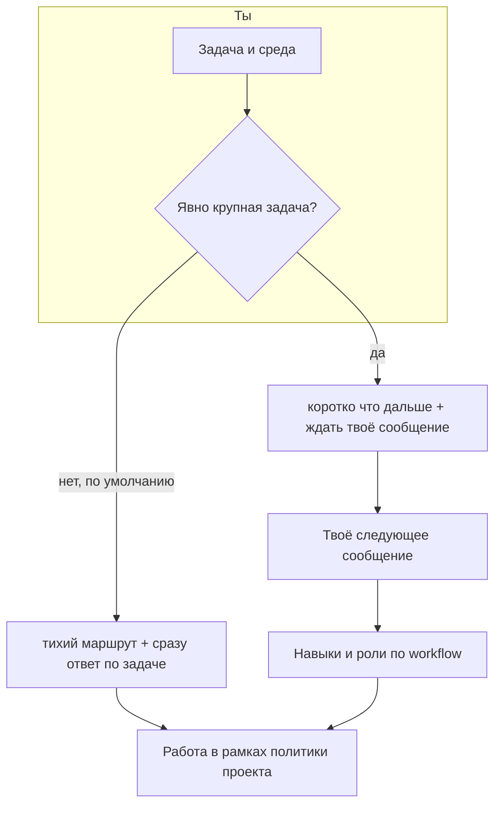

# Pauk

Оснастка для **сред разработки с использованием ИИ**, ориентированная на работу с кодом 1С.   

Даёт ассистенту общие правила, политику «что нельзя», набор **навыков** по узким темам (запросы, формы, транзакции и ошибки, БСП, стиль кода) и понятный **порядок шагов** в диалоге — чтобы не заливать в контекст всё сразу и не путать планирование с работой по коду.

По умолчанию задача считается **обычной (локальной)**: ассистент **тихо** выбирает навыки и цепочку ролей по правилам оснастки (внутренний маршрут `route`) и **сразу** отвечает по сути задачи — отдельное «нажми продолжай» не нужно, **YAML маршрута в чат не обязателен** (и по умолчанию не показывается). Если ты **явно** скажешь, что задача **крупная / объёмная** (полный цикл, много модулей, отдельный аналитический проход и т.п.), оснастка переключится на **`scale: full`**: короткое сообщение, что будет дальше и что написать в ответ; следующее твоё сообщение подключает навыки и роли по цепочке. Маршрут или YAML можно **попросить показать**; правки — обычным языком («убери навык про запросы»).

### От правила до навыков

1. **Правило Cursor** (файл вроде `.cursor/rules/pauk-entry.mdc`) подмешивается к диалогу **само**, пока открыт проект с установленным Pauk. В нём зафиксирован порядок: масштаб **не** спрашивается отдельным вопросом; маршрут фиксируется **внутренне**; в чат по умолчанию — не YAML, а сразу полезный текст (для крупной задачи — короткая подсказка и пауза до следующего сообщения; см. `pauk/routing/PROTOCOL.md`).
2. **Политика** из `pauk/policy/A-INVARIANTS.md` действует на всех шагах: что считать готовым, чего избегать, как принимать решения по спорным местам. На неё же ссылается правило — это не «навык», а рамка поверх всего диалога.
3. **Каталог маршрутизации** `pauk/routing/SKILLS-CATALOG.md` — сжатая таблица: идентификатор навыка и одна строка, когда он уместен. Именно оттуда ассистент берёт **допустимые имена** для поля `skills` во внутреннем `route`; выдуманный id класть нельзя.
4. **Первый ответ по обычной задаче** (`scale: trivial` по умолчанию) — **в том же сообщении** подключаются выбранные навыки и выполняется работа (без обязательного показа YAML). Для **`scale: full`** в первом сообщении — короткий текст «что дальше», без развёрнутой реализации; тексты навыков — со **следующего** твоего сообщения.
5. Для каждого id из `route.skills` ассистент открывает `**pauk/skills/<id>/SKILL.md**`, остальное — по ссылкам из навыка. Роли субагентов из `route.workflow` — по очереди, как описано под `pauk/subagents/` (для `full` — после твоего следующего сообщения).

Итого: правило задаёт **ритм и границы ответов**, каталог — **меню навыков**, внутренний **`route`** — **что заказано на этот заход** (пользователю по умолчанию не показывается), а `SKILL.md` — **полное содержание** выбранных пунктов меню.

Подробный порядок шагов и формат ответов — в `pauk/routing/PROTOCOL.md`.

## Как это выглядит в работе

## Установка

Нужен **Cursor** (или среда с поддержкой `.cursor/rules`).

1. Возьми каталоги `**pauk`** и `**.cursor**` из поставки Pauk: в дистрибутиве они лежат рядом, в исходниках этого репозитория — внутри папки `**pauk-product**`. Скопируй оба каталога в **корень** своего репозитория с конфигурацией, внешними обработками или выгрузкой кода 1С.
2. Убедись, что появились файлы вроде `.cursor/rules/pauk-entry.mdc` и `pauk/routing/PROTOCOL.md`.
3. Если переименуешь папку `pauk`, поправь ссылки на неё в `pauk-entry.mdc` и в путях внутри `pauk/`, где они заданы явно.

Дальше работаешь в чате как обычно: открой в Cursor папку того репозитория, куда положил `pauk` и `.cursor` — правила подхватятся сами.

---

**Про этот репозиторий:** здесь же живёт «фабрика» — черновики идеи, `docs/` и развитие того же пакета. Если тебе нужна только оснастка в проекте, достаточно скопировать `pauk` и `.cursor` из `pauk-product`. Разработчикам оснастки: см. `docs/PRODUCTION-BUNDLE.md`.