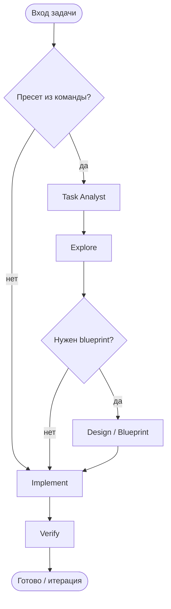

# Субагенты и workflow (черновик v0)

Документ задаёт **имена ролей**, **триггеры**, **запреты на запись** и **формат передачи** между шагами. Модель-агностично: исполнитель любой, контракт артефактов один.

Связь с концепцией: [CONCEPT.md](CONCEPT.md) (слой B, §2.1 семантический слой, условный Design/Blueprint). Порядок **до** первого узла на схеме — [ROUTING-ENTRY.md](ROUTING-ENTRY.md): по умолчанию внутренний маршрут и сразу работа (YAML пользователю не обязателен); объёмный контур — команда из **`.cursor/commands/`** и пресет в [WORKFLOW.md](../pauk-product/pauk/subagents/WORKFLOW.md).

---

## 1. Цепочка v0 (обзор)

- **До диаграммы:** без команды-пресета — одно содержательное сообщение, короткий **`route.workflow`** (часто **Implement → Verify**); отдельный вопрос модели про «мелкая / нетривиально» не задаётся. Объёмный контур — только через **`flow-full-pipeline`** / **`flow-technical-design`** (см. [ROUTING-ENTRY.md](ROUTING-ENTRY.md), [PROTOCOL.md](../pauk-product/pauk/routing/PROTOCOL.md), [WORKFLOW.md](../pauk-product/pauk/subagents/WORKFLOW.md)). YAML `route` в чат — по запросу пользователя (см. PROTOCOL).
- **Обычный ввод** — локальное изменение без длинной цепочки ролей: **Implement → Verify** (при необходимости лёгкий Explore).
- **Пресет объёмной задачи** — полная цепочка с **Task Analyst** в начале и режимом первого ответа из таблицы пресетов в **WORKFLOW.md**.

---

## 2. Роли субагентов (минимальный набор)

| ID             | Роль                           | Запись в репозиторий | Назначение                                                                                                                                                                                                  |
| -------------- | ------------------------------ | -------------------- | ----------------------------------------------------------------------------------------------------------------------------------------------------------------------------------------------------------- |
| `task-analyst` | **Аналитик задачи**            | **Нет**              | Семантический слой: смысл задачи, риски, недостающие данные, класс задачи; **перечень навыков оси 1** (id из будущего каталога или описательные метки до появления каталога); рекомендация следующего шага. |
| `explore`      | **Разведка кода**              | **Нет**              | Поиск по конфигурации/репозиторию, список затронутых объектов, ссылки на ключевые модули, гипотезы без правок.                                                                                              |
| `design`       | **Проектирование / Blueprint** | **Нет**              | Условно: крупноблочный псевдокод, зависимости, порядок вызовов, границы клиент/сервер — по критериям из §3.                                                                                                 |
| `implement`    | **Реализация**                 | **Да**               | Правки BSL/метаданных по согласованному плану; не расширять scope без возврата к Analyst/Design.                                                                                                            |
| `verify`       | **Проверка**                   | По ситуации          | Чеклист, линтеры, согласованность с артефактами Analyst/Design; замечания → при необходимости новый цикл (не обязательно с начала цепочки).                                                                 |

Имена **ID** — стабильные ключи для оркестрации и логов; человекочитаемые названия можно менять в UI.

---

## 3. Когда вызывать `design` (blueprint)

Включать **не** для каждой мелочи. Типичные сигналы «нужен blueprint»:

- новая нетривиальная подсистема или несколько новых точек входа;
- неочевидные зависимости между общими модулями, формами и серверной логикой;
- обмен, конвертация, имитация пользовательского заполнения, многократные постобработки;
- явный запрос пользователя на проектирование до кода.

Пропускать, если объём изменений мал и контракт уже зафиксирован (например, правка формулировки, одна процедура, согласованный hotfix).

Решение «включить / пропустить» принимает **оркестратор** (человек или шаг перед субагентами) и фиксируется в передаче контекста следующей роли.

---

## 4. Артефакт: выход **Task Analyst** (`task-analyst`)

Цель — один связный документ, который следующие роли используют как **контракт смысла** и **карту навыков**. Рекомендуемая структура (Markdown):

### 4.1. Заголовок и классификация

- **Краткое резюме задачи** (1–3 предложения).
- **Класс задачи** (свободные теги): например `интеграция`, `обмен`, `документ`, `постобработка`, `клиент-сервер`, `метаданные`, …

### 4.2. Критерий готовности (черновик)

- Что должно быть истинно в продукте/конфигурации, чтобы задачу закрыть (проверяемые формулировки).

### 4.3. Риски и ограничения

- Данные из внешнего источника **недостаточны** для семантики объекта — да/нет, что именно неизвестно.
- Нужна **имитация пользовательского сценария** / скрытые реквизиты / цепочка заполнения — явно перечислить.
- Регистры, блокировки, транзакции, производительность — если релевантно.

### 4.4. Карта навыков оси 1

Таблица или список: **метка навыка** (позже — `skill_id` из каталога) + **одна строка зачем** в контексте этой задачи.

Пример строк (до появления каталога — описательные метки):

| Метка                      | Зачем в этой задаче                                            |
| -------------------------- | -------------------------------------------------------------- |
| `platform-metadata`        | Найти реквизиты, формы, подписки, связи объекта                |
| `platform-client-server`   | Разделить, что выполняется на клиенте при «как у пользователя» |
| `platform-forms`           | Обработчики при открытии/записи, скрытые поля                  |
| `platform-data-conversion` | Правила сопоставления при обмене                               |
| `platform-http-api`        | Если обмен через HTTP — контракты и ошибки                     |

### 4.5. Рекомендуемый следующий шаг

- Одно из: `explore` → (`design` при необходимости) → `implement` → `verify`, с кратким обоснованием.

### 4.6. Открытые вопросы к пользователю / коду

- Явный список; без них нельзя безопасно реализовать — помечать блокирующими.

---

## 5. Артефакт: выход **Explore** (`explore`)

- Список **файлов / объектов метаданных** для внимания.
- **Цитаты или якоря** (процедуры, строки) — по возможности без огромных вставок.
- **Гипотезы** и что проверить в `implement` / `design`.

Без правок кода.

---

## 6. Артефакт: выход **Design** (`design`)

- Крупные блоки (подсистемы смысла, не обязательно модули 1:1).
- **Граф зависимостей** или нумерованный порядок шагов.
- **Последовательность вызовов** (кто кого вызывает, где граница клиент/сервер).
- Явное указание, что **намеренно** вне scope текущей задачи.

Без правок кода до **явного принятия человеком** — см. [LAYER-A.md](LAYER-A.md) §4 (blueprint).

---

## 7. Handoff (что передаётся дальше)

| От                   | К              | Минимум в контексте                                                             |
| -------------------- | -------------- | ------------------------------------------------------------------------------- |
| Оркестратор          | `task-analyst` | Исходная формулировка задачи, известные файлы, политика A (кратко).             |
| `task-analyst`       | `explore`      | Весь артефакт §4 + приоритетные области поиска.                                 |
| `explore`            | `design`       | Артефакт Explore + сжатый §4.                                                   |
| `explore` / `design` | `implement`    | План + **явный список** разрешённых файлов/объектов для изменения (желательно). |
| `implement`          | `verify`       | Diff-область, какие тесты/ручные сценарии применимы.                            |

---

## 8. Следующие итерации документа

- Вынести **промпты ролей** в отдельные файлы (когда появится репозиторий шаблонов Cursor).
- Связать §4.4 с реальными `skill_id` из будущего `SKILLS-CATALOG.md`.
- ADR: «кто решает мелкая / нетривиальная — только человек или отдельный шаг-классификатор».

